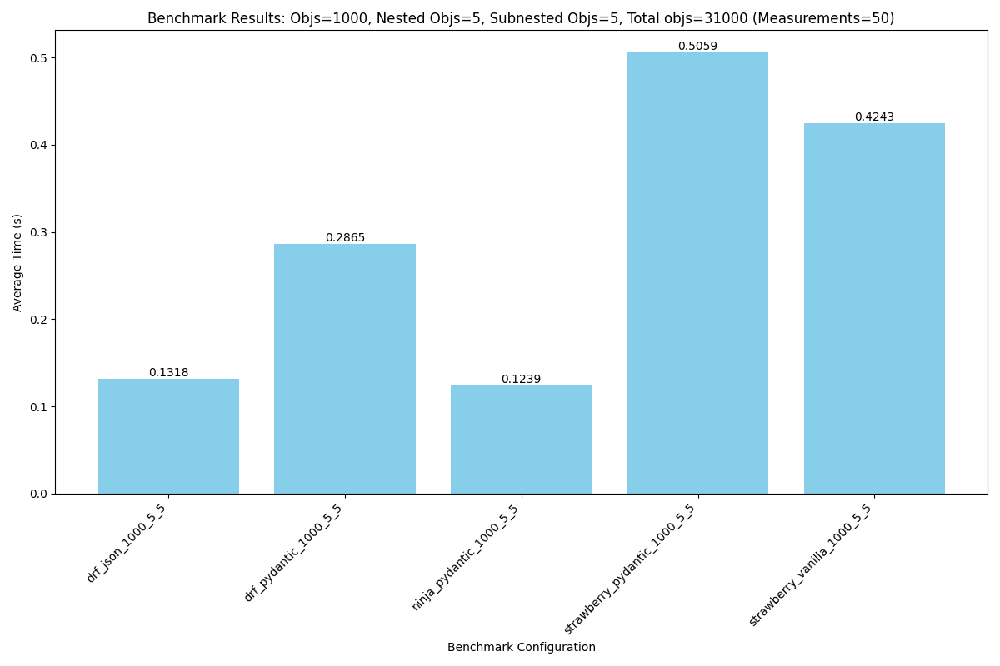

# Django Serialization Benchmarks

This project benchmarks various Django serialization methods, including Django REST Framework (DRF), Django Ninja, and Strawberry GraphQL.



## Generating Sample Data

Before running benchmarks, you need to generate the sample JSON data files that the benchmarks will use.

To generate a full set of sample data:

```bash
python scripts/generate_sample_data.py
```

This will create various JSON files in the `sample_data/` directory with different sizes and nesting levels (e.g., `benchmark_data_100_5_5.json`).

## Running Benchmarks

The benchmark suite automates the process of testing different API endpoints and visualizing the results.

To run the benchmarks:

```bash
bash scripts/benchmark.sh
```

### What happens during the benchmark?

When you run `benchmark.sh`, the following steps are performed for each configured dataset size:

1.  **Iterates through Endpoints**: The script tests multiple implementations:
    *   **Strawberry GraphQL** (Vanilla and Pydantic-based)
    *   **Django Ninja** (Pydantic-based)
    *   **Django REST Framework** (Pydantic-based and JSON Model)
2.  **Executes Performance Tests**: For each endpoint, `scripts/run_benchmark.py` starts a temporary Django server, performs a "warm-up" request, and then measures the execution time of multiple subsequent requests to calculate an average.
3.  **Saves Results**: Individual results for each endpoint/size combination are saved as YAML files in the `results/` directory.
4.  **Generates Charts**: After testing all endpoints for a specific dataset size, the script calls `scripts/generate_chart.py`. This script:
    *   Reads the YAML results for that size.
    *   Creates a bar chart comparing the average response times.
    *   Saves the chart as a PNG file (e.g., `results/benchmark_chart_100_5_5.png`).

You can find all raw data and visualization images in the `results/` folder after the script completes.

## Running Tests

To verify that all endpoints return consistent data and follow the camelCase naming convention, run the unit tests:

```bash
python manage.py test django_serialization_benchmarks.tests
```

## Setup

To set up the project environment and install dependencies, follow these steps:

### Prerequisites

- Python 3.11 or higher

### Installation

1. **Create the virtual environment:**

   ```bash
   python3.11 -m venv .venv
   ```

2. **Activate the virtual environment:**

   - On macOS/Linux:
     ```bash
     source .venv/bin/activate
     ```
   - On Windows (Command Prompt):
     ```cmd
     .venv\Scripts\activate
     ```

3. **Install the dependencies:**

   Install the dependencies directly from `pyproject.toml` using `pip`:

   ```bash
   pip install .
   ```
